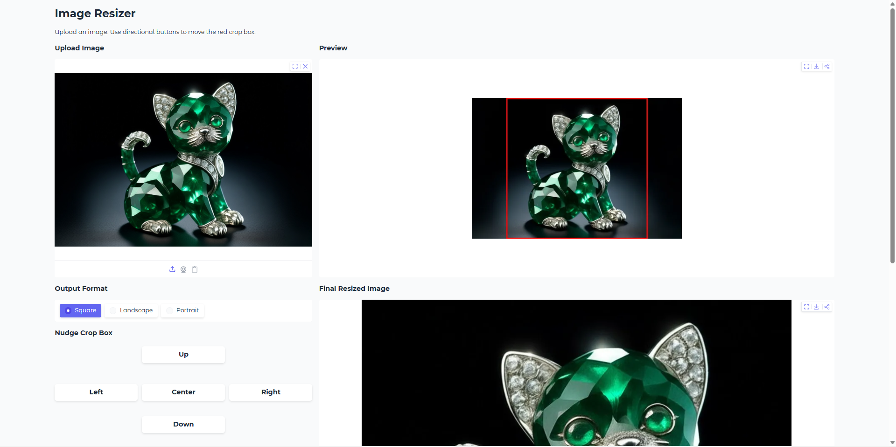

# 🖼️ Image Resizer: Precision Crop \& Aspect Engine

[](https://www.python.org/)
[](https://gradio.app/)
[](https://python-pillow.org/)

A local-first precision image cropping and resizing tool built for Windows 11.  
Designed for deterministic aspect-ratio exports with fine-grained control.



---

## 🎯 Purpose

Most image resizers either:
- distort aspect ratios  
- offer poor crop control  
- or hide the math behind opaque UI behavior  


This tool keeps everything explicit:
- Preview-space overlay  
- Accurate original-space scaling  
- Deterministic aspect locking  
- Fine incremental nudge control  

---

## 🧠 Design Philosophy

- \*\*Aspect-First Cropping\*\*  
Overlay size is computed from target output ratio.

- \*\*Preview-Space Interaction\*\*  
All movement occurs in preview coordinates for intuitive UX.

- \*\*Exact Original Scaling\*\*
Crop region is scaled back to full-resolution before resize.

- \*\*High-Quality Resampling\*\*  
Uses `Image.Resampling.LANCZOS`.

---

## 🚀 Installation (Windows 11)

### 1. Create Environment

```cmd
conda create -n resizer-env python=3.11 -y
conda activate resizer-env
```

### 2. Install Dependencies

```cmd
pip install -r requirements.txt
```

### 3. 🏃 Execution

```cmd
conda activate resizer-env
python image\\\_resizer.py
```

---

## Output Formats

| Format     | Resolution |
|------------|------------|
| Square     | 1024×1024  |
| Landscape  | 1216×832   |
| Portrait   | 832×1216   |

---

## 📂 Project Structure

```
Image-Resizer/
│
├── image\_resizer.py
├── requirements.txt
├── README.md
├── .gitignore
└── Assets/
   └── screenshot.png
```

---

## ⚙️Tech Stack

- Python 3.11
- Gradio 6
- Pillow
  
---

## 🧩 Notes

- Movement buttons use half-step precision for fine control.
- The crop overlay is computed in preview space but scaled accurately to the original image.
- Designed for consistent aspect-ratio exports without distortion.


